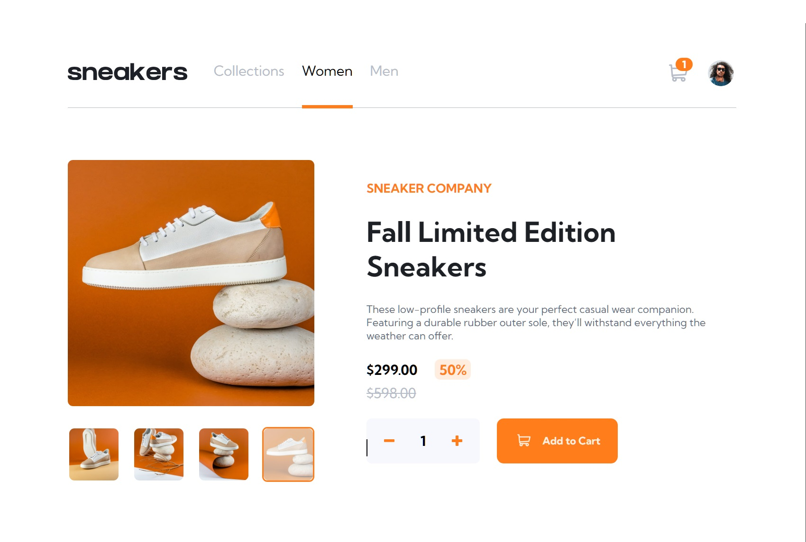
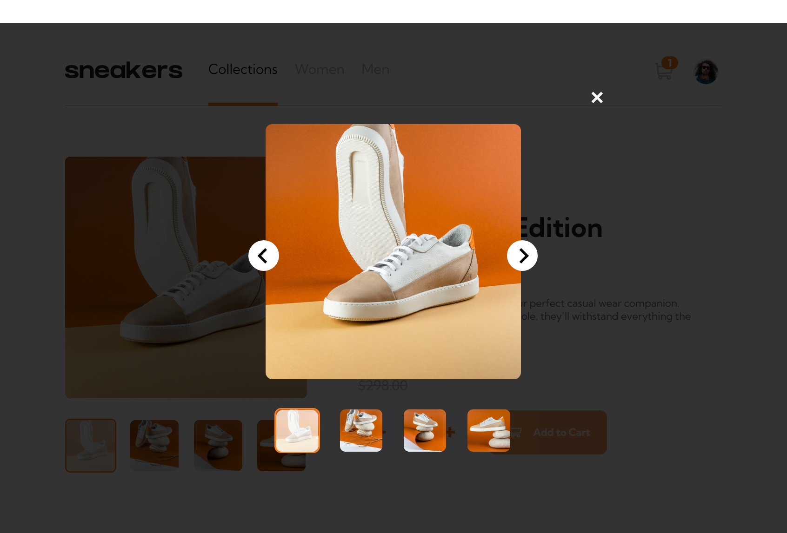
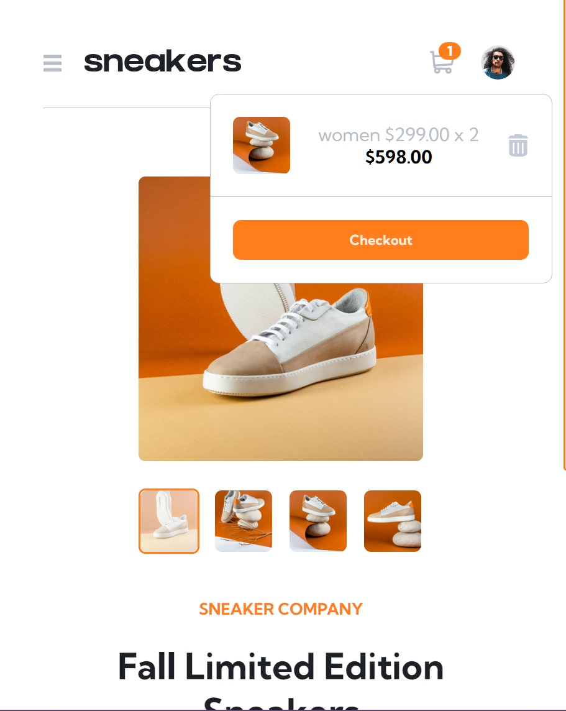
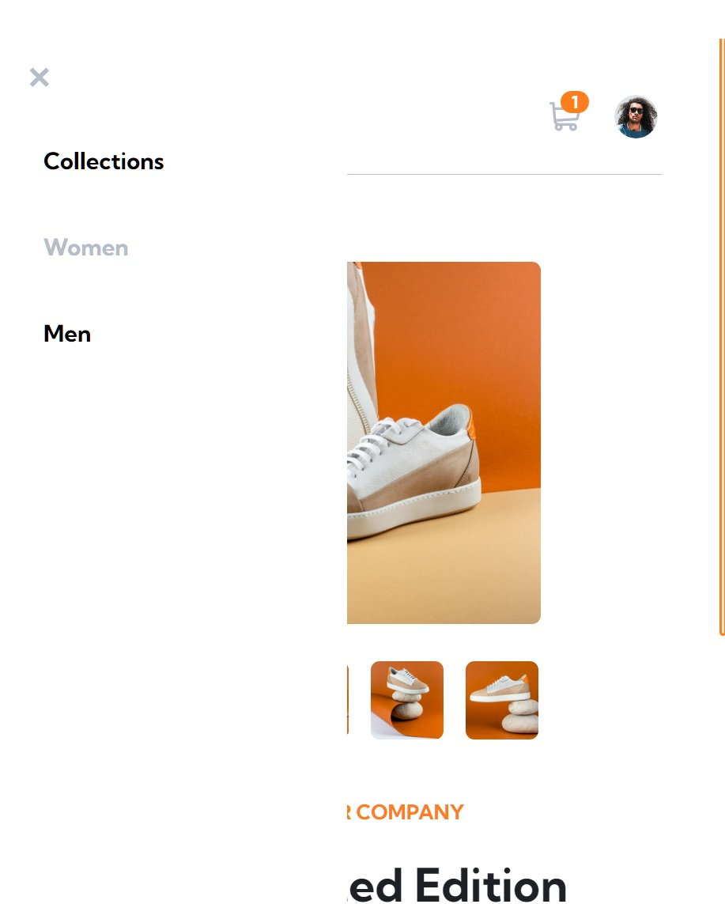

# Frontend Mentor - E-commerce product page solution

This is a solution to the [E-commerce product page challenge on Frontend Mentor](https://www.frontendmentor.io/challenges/ecommerce-product-page-UPsZ9MJp6). Frontend Mentor challenges help you improve your coding skills by building realistic projects.

### Links

- Solution URL: [Github](https://github.com/SdevWeb7/Sneakers)
- Live Site URL: [Add live site URL here](https://SdevWeb7.github.io/Sneakers)

### Built with

- Semantic HTML5 markup
- CSS custom properties
- Flexbox
- [React](https://reactjs.org/) - JS library

## Author

- Website - [SdevWeb](https://sdevweb.com)
- Frontend Mentor - [@Veustyle](https://www.frontendmentor.io/profile/Veustyle)
- Email - sd@sdevweb.com